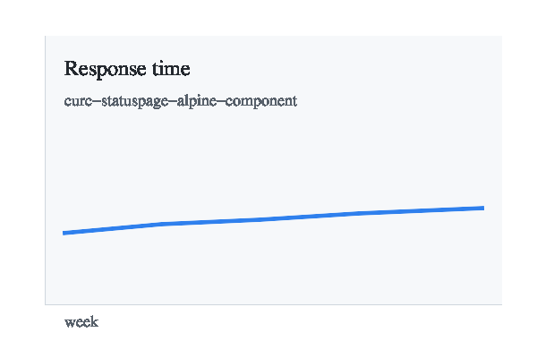
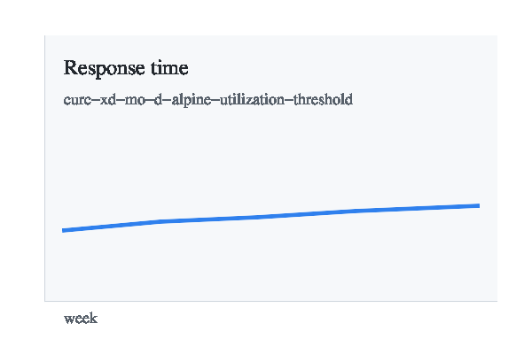
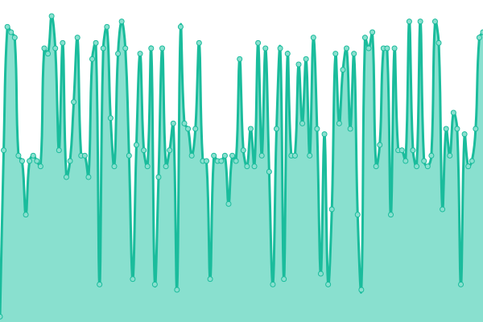
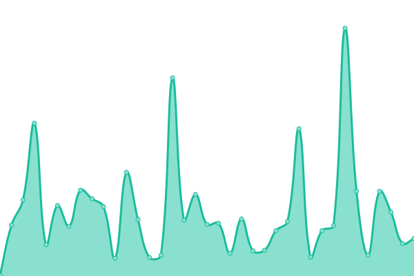
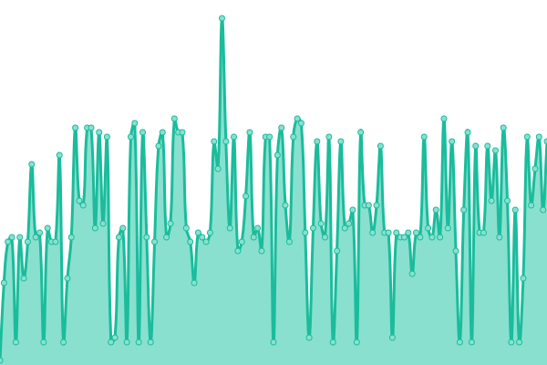
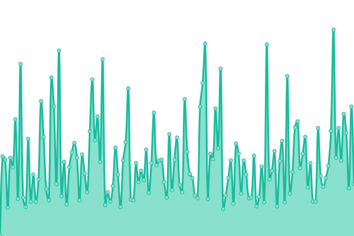
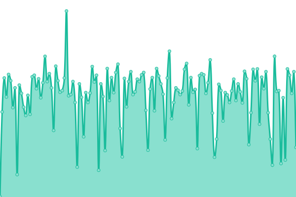
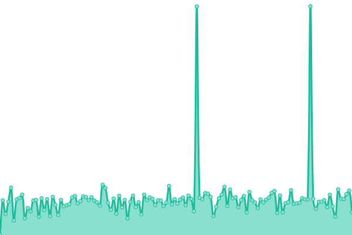
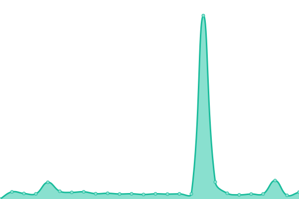

# CU Research Computing Status

## Current status

<!--start: status pages-->
<!-- This summary is generated by Upptime (https://github.com/upptime/upptime) -->
<!-- Do not edit this manually, your changes will be overwritten -->
<!-- prettier-ignore -->
| URL | Status | History | Response Time | Uptime |
| --- | ------ | ------- | ------------- | ------ |
|  [CURC Statuspage Alpine Component](https://curc.statuspage.io/api/v2/summary.json) | 🟩 Up | [curc-statuspage-alpine-component.yml](https://github.com/d33bs/upptime-curc/commits/HEAD/history/curc-statuspage-alpine-component.yml) | 

 414ms
     
 | 

<a href="https://d33bs.github.io/upptime-curc/history/curc-statuspage-alpine-component">100.00%</a>
    

|  [📈 CURC XDMoD Alpine Utilization Threshold](https://raw.githubusercontent.com/d33bs/upptime-curc/HEAD/api/curc-xdmod-alpine-utilization-threshold/status.json) | 🟩 Up | [curc-xd-mo-d-alpine-utilization-threshold.yml](https://github.com/d33bs/upptime-curc/commits/HEAD/history/curc-xd-mo-d-alpine-utilization-threshold.yml) | 

 90ms
     
 | 

<a href="https://d33bs.github.io/upptime-curc/history/curc-xd-mo-d-alpine-utilization-threshold">57.71%</a>
    

|  [⛰️🚪 Alpine Login Node SSH (TCP Reachability)](login.rc.colorado.edu) | 🟩 Up | [alpine-login-node-ssh-tcp-reachability.yml](https://github.com/d33bs/upptime-curc/commits/HEAD/history/alpine-login-node-ssh-tcp-reachability.yml) | 

 37ms
     
 | 

<a href="https://d33bs.github.io/upptime-curc/history/alpine-login-node-ssh-tcp-reachability">100.00%</a>
    

|  [Alpine CURC Page](https://www.colorado.edu/rc/alpine) | 🟩 Up | [alpine-curc-page.yml](https://github.com/d33bs/upptime-curc/commits/HEAD/history/alpine-curc-page.yml) | 

 122ms
     
 | 

<a href="https://d33bs.github.io/upptime-curc/history/alpine-curc-page">100.00%</a>
    

|  [CURC Open OnDemand HTTPS (TCP Reachability)](ondemand.rc.colorado.edu) | 🟩 Up | [curc-open-on-demand-https-tcp-reachability.yml](https://github.com/d33bs/upptime-curc/commits/HEAD/history/curc-open-on-demand-https-tcp-reachability.yml) | 

 37ms
     
 | 

<a href="https://d33bs.github.io/upptime-curc/history/curc-open-on-demand-https-tcp-reachability">100.00%</a>
    

|  [CURC Data Transfer Node SSH (TCP Reachability)](dtn.rc.colorado.edu) | 🟩 Up | [curc-data-transfer-node-ssh-tcp-reachability.yml](https://github.com/d33bs/upptime-curc/commits/HEAD/history/curc-data-transfer-node-ssh-tcp-reachability.yml) | 

 35ms
     
 | 

<a href="https://d33bs.github.io/upptime-curc/history/curc-data-transfer-node-ssh-tcp-reachability">100.00%</a>
    

|  [CURC Docs (Public Webpage)](https://curc.readthedocs.io/en/latest/) | 🟩 Up | [curc-docs-public-webpage.yml](https://github.com/d33bs/upptime-curc/commits/HEAD/history/curc-docs-public-webpage.yml) | 

 133ms
     
 | 

<a href="https://d33bs.github.io/upptime-curc/history/curc-docs-public-webpage">100.00%</a>
    

|  [Globus Transfer API (Technical Endpoint)](https://transfer.api.globus.org) | 🟩 Up | [globus-transfer-api-technical-endpoint.yml](https://github.com/d33bs/upptime-curc/commits/HEAD/history/globus-transfer-api-technical-endpoint.yml) | 

 261ms
     
 | 

<a href="https://d33bs.github.io/upptime-curc/history/globus-transfer-api-technical-endpoint">100.00%</a>
    

|  [ACCESS Registry (Technical Endpoint)](https://registry.access-ci.org/registry/) | 🟩 Up | [access-registry-technical-endpoint.yml](https://github.com/d33bs/upptime-curc/commits/HEAD/history/access-registry-technical-endpoint.yml) | 

 560ms
     
 | 

<a href="https://d33bs.github.io/upptime-curc/history/access-registry-technical-endpoint">100.00%</a>
    

|  [Globus Website (Public Webpage)](https://www.globus.org) | 🟩 Up | [globus-website-public-webpage.yml](https://github.com/d33bs/upptime-curc/commits/HEAD/history/globus-website-public-webpage.yml) | 

 259ms
     
 | 

<a href="https://d33bs.github.io/upptime-curc/history/globus-website-public-webpage">100.00%</a>
    

|  [ACCESS Website (Public Webpage)](https://access-ci.org) | 🟩 Up | [access-website-public-webpage.yml](https://github.com/d33bs/upptime-curc/commits/HEAD/history/access-website-public-webpage.yml) | 

 874ms
     
 | 

<a href="https://d33bs.github.io/upptime-curc/history/access-website-public-webpage">85.97%</a>
    

<!--end: status pages-->

## Maintenance and service status links

- CURC planned maintenance policy (first Wednesday each month): https://curc.readthedocs.io/en/latest/additional-resources/policies.html
- CURC status and maintenance announcements: https://curc.statuspage.io/
- ACCESS outages and planned downtimes: https://support.access-ci.org/outages
- ACCESS operations/service catalog: https://operations.access-ci.org/
- Globus support and service help: https://www.globus.org/support/

This repository uses [Upptime](https://upptime.js.org) to monitor practical CURC user access and key partner endpoints.

Live status page: `https://d33bs.github.io/upptime-curc/`

## Checks

- CURC Statuspage Alpine Component
- CURC XDMoD Alpine Utilization Threshold
- Alpine Login Node SSH (TCP Reachability)
- Alpine CURC Page
- CURC Open OnDemand HTTPS (TCP Reachability)
- CURC Data Transfer Node SSH (TCP Reachability)
- CURC Docs (Public Webpage)
- Globus Transfer API (Technical Endpoint)
- ACCESS Registry (Technical Endpoint)
- Globus Website (Public Webpage)
- ACCESS Website (Public Webpage)

## How it works

- Checks run on a schedule via GitHub Actions
- Downtime opens/closes incidents as GitHub issues
- Historical uptime and response-time data are committed in this repo

## GitHub setup

See [GITHUB_SETUP.md](GITHUB_SETUP.md) for required repository settings and first-run bootstrap steps.
